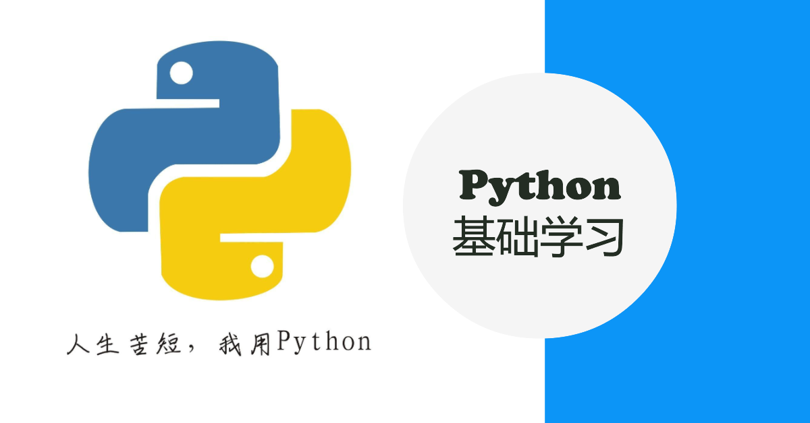

# **Python基础文章系列**

|   **Python 基础 （一）Python基本认识与环境搭建**   | **[Python 基础 （一）Python基本认识与环境搭建](https://blog.csdn.net/Darwin_Bossen/article/details/132630810)** |
| :------------------------------------------------: | ------------------------------------------------------------ |
|   **Python 基础 （二）Python变量与基本数据类型**   | **[Python 基础 （二）Python变量与基本数据类型](https://blog.csdn.net/Darwin_Bossen/article/details/132636186)** |
|   **Python 基础 （三）Python基本语句与基本运算**   | **[Python 基础 （三）Python基本语句与基本运算](https://blog.csdn.net/Darwin_Bossen/article/details/132637349)** |
|          **Python 基础 （四）Python函数**          | **[Python 基础 （四）Python函数](https://blog.csdn.net/Darwin_Bossen/article/details/132639025)** |
|        **Python 基础 （五）Python包与模块**        | **[Python 基础 （五）Python包与模块](https://blog.csdn.net/Darwin_Bossen/article/details/132641698)** |
|       **Python 基础 （六）Python的文件模块**       | **[Python 基础 （六）Python的文件模块](https://blog.csdn.net/Darwin_Bossen/article/details/132641711)** |
|     **Python 基础 （七）Python的异常处理机制**     | **[Python 基础 （七）Python的异常处理机制](https://blog.csdn.net/Darwin_Bossen/article/details/132646251)** |
|       **Python 基础 （八）Python的类与对象**       | **[Python 基础 （八）Python的类与对象](https://blog.csdn.net/Darwin_Bossen/article/details/132649863)** |
|       **Python 基础 （九）Python的内置模块**       | **[Python 基础 （九）Python的内置模块](https://blog.csdn.net/Darwin_Bossen/article/details/132650579)** |
| **Python 基础 （十）Python实现简单的图书管理系统** | **[Python 基础 （十）Python实现简单的图书管理系统](https://blog.csdn.net/Darwin_Bossen/article/details/132654796)** |

